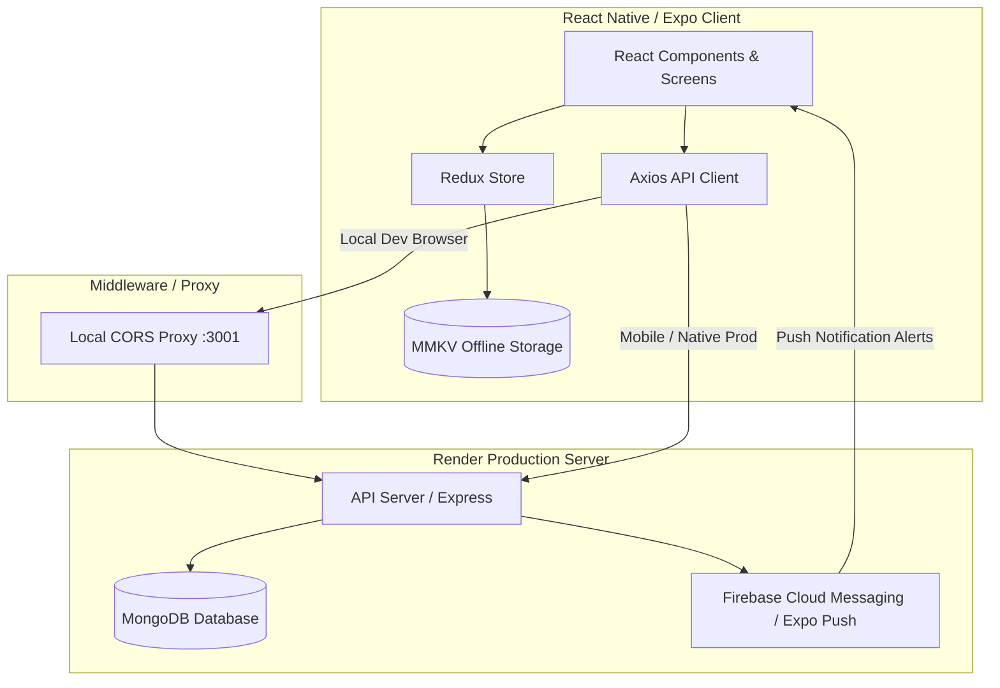
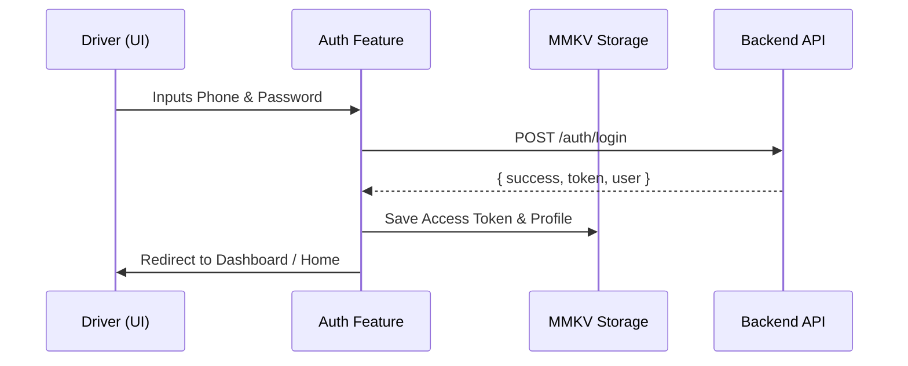
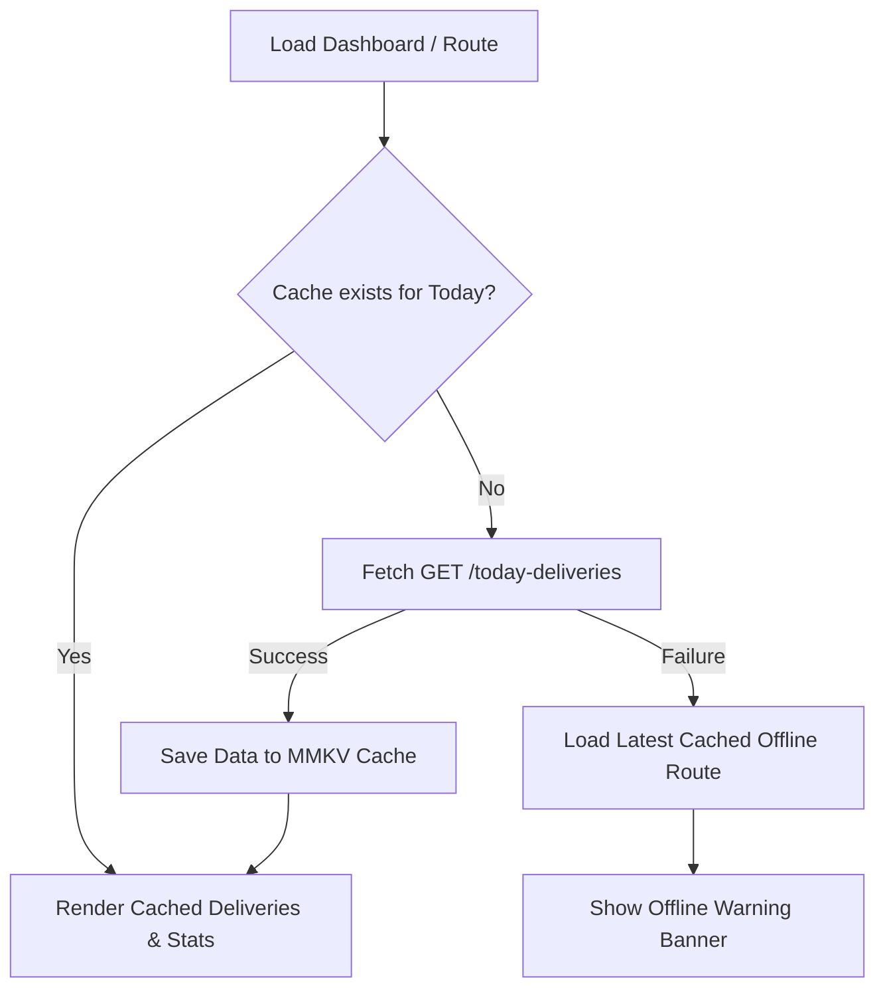
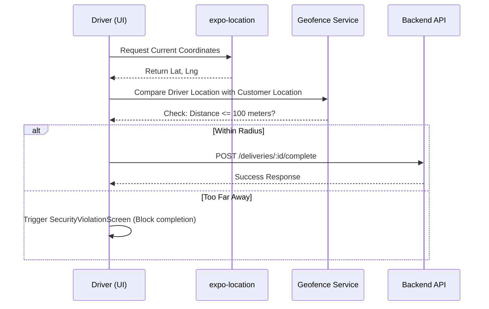

# 🏗️ Ram Bhaji Driver App — System Design Document

This document outlines the system architecture, component design, data flows, and technical implementations of the **Ram Bhaji Driver App** (v1.0.0).

---

## 1. System Architecture Overview

The Ram Bhaji Driver App is built on a **Client-Server Architecture** with a heavy focus on **Offline-First Capabilities** and **Real-Time Data Processing**. The client is a React Native app built using Expo SDK 54, and the backend is a Node.js API hosted on Render.



---

## 2. Component Design & Directory Structure

The project utilizes a **Feature-Sliced Design Pattern** under `src/` to separate business logic and components by domain.

```
rambhaji/
├── app/                          # File-Based Routing (Expo Router v6)
│   ├── (auth)/                   # Auth Group (login, otp)
│   ├── (tabs)/                   # App Core Tabs (dashboard, deliveries, map, profile, returns, admin)
│   ├── order/[id].js             # Dynamic Delivery Order Detail View
│   └── notifications.js          # Notification Inbox view
├── src/                          # Business logic divided by domain features
│   ├── components/
│   │   └── common/               # Reusable Motion/Animation components & Modals
│   ├── features/
│   │   ├── auth/                 # Session logic, JWT persistence
│   │   ├── routes/               # Delivery listings & caching
│   │   ├── sync/                 # Offline sync queue
│   │   ├── notifications/        # Push notifications registration & liseners
│   │   └── tracking/             # GPS telemetry reporting
│   ├── core/
│   │   ├── network/              # Axios config, logs forwarder, retry logic
│   │   ├── storage/              # MMKV secure key-value stores
│   │   └── security/             # GPS distance geofencing checks
│   └── store/                    # Redux Root configurations
```

---

## 3. Core Workflows & Data Flows

### A. Authentication & Secure Session Flow
The application uses JSON Web Tokens (JWT) for session management. Tokens are persisted using an ultra-fast local C++ backed store (**MMKV**).



### B. Offline Caching & Shift Loading Flow
To ensure that drivers can work in areas with poor network coverage, the application fetches the daily route data and caches it locally.



### C. Delivery Completion & Geofenced Verification
Drivers must be physically close to the customer's coordinates to complete a delivery. The client verifies coordinates before hitting the complete endpoint.



---

## 4. Technical Implementations

### A. Dynamic API Client with Logging & Auto-Retry
All network communication flows through a centralized Axios client ([apiClient.js](file:///c:/Users/ASUS/Desktop/rambhaji/src/core/network/apiClient.js)):
* **Timeout & Retries**: Set to `60000ms` with up to 2 automatic retries on timeout/network failure to handle Render free-tier cold starts.
* **Terminal Log Forwarder**: Includes a custom interceptor that forwards formatted console logs (`API REQUEST`, `API RESPONSE`, `API ERROR`) via `HTTP POST` to `http://localhost:3001/log-terminal` so developers can monitor network logs in their terminals during local web testing.

### B. Real-Time Push Notification Engine
Configured with `expo-notifications` for deep integration:
* **FCM Registration**: Generates device tokens and registers them at `POST /notifications/register-token`.
* **Dynamic Listeners**:
  * `addNotificationReceivedListener`: Runs when the app is in the foreground, showing alerts and instantly updating the Redux store with the payload.
  * `addNotificationResponseReceivedListener`: Captures taps on incoming notifications to mark them as read and redirect screens dynamically.

### C. State Management
* **Redux Toolkit**: Manages app state across slices (`authSlice`, `routeSlice`, `notificationSlice`, `syncSlice`).
* **Root Reducer**: Centralizes storage resets on logout and sync routines.

---

## 5. Security & Geofence Policy

* **GPS Coordinates**: Locked to a standard `GEOFENCE_RADIUS_METERS` configuration (Default: `100` meters).
* **Request Signature**: Outgoing HTTP headers inject a secure timestamp `X-RamBhaji-Timestamp` to prevent replay attacks and ensure synchronized logging.
