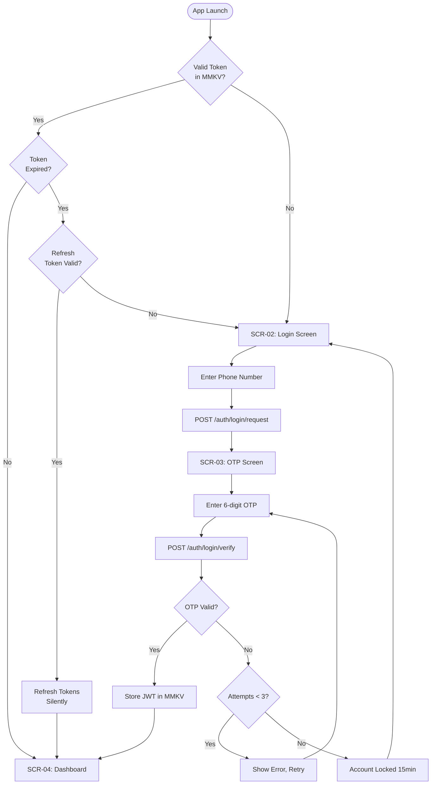
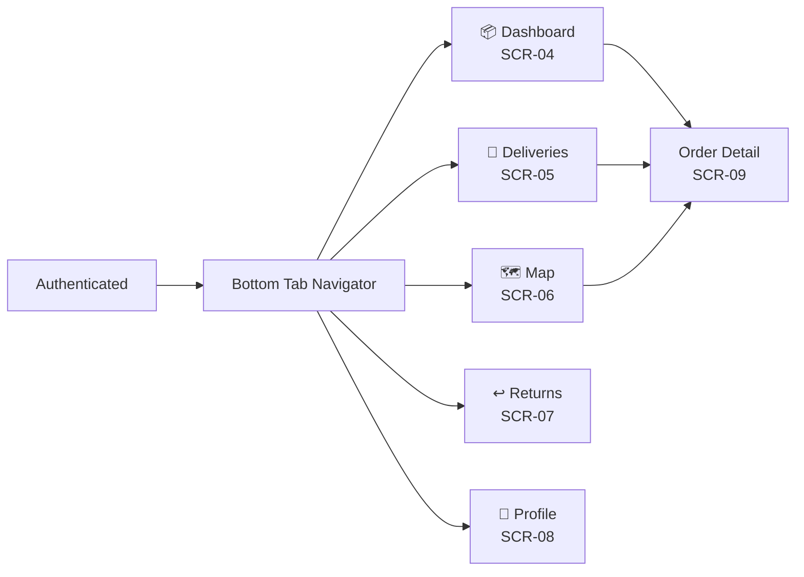
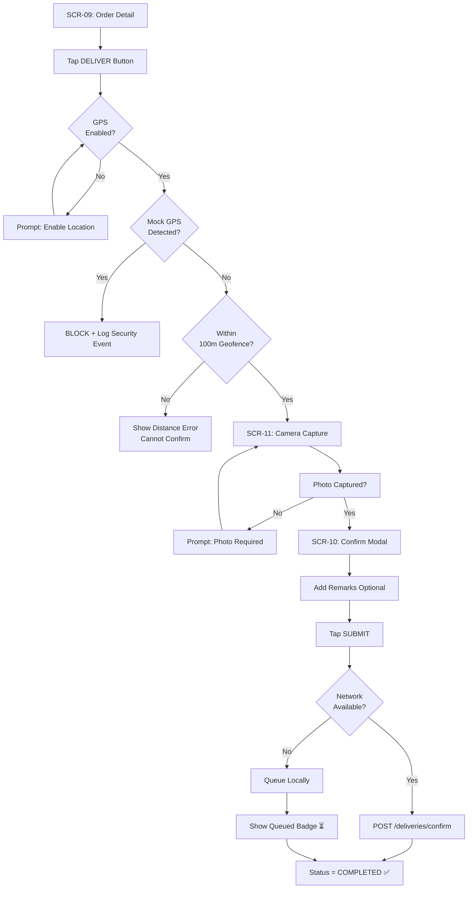
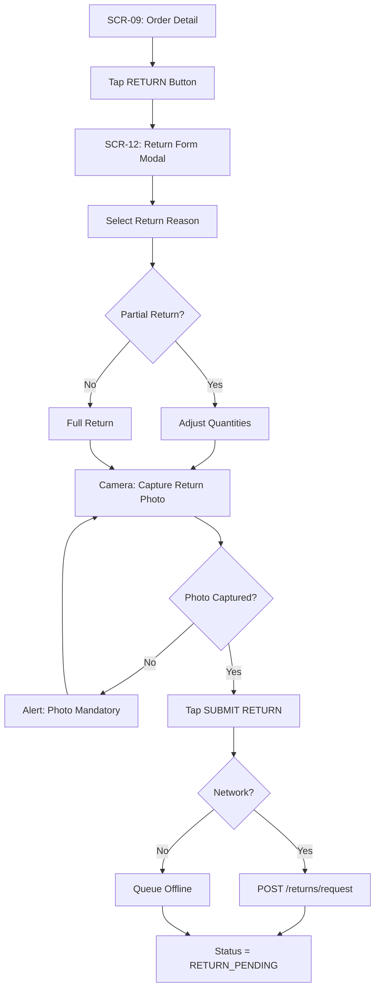
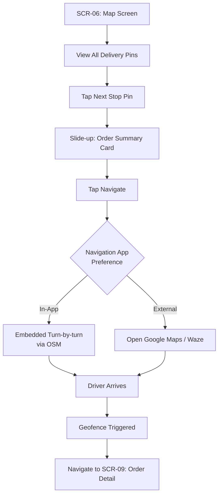
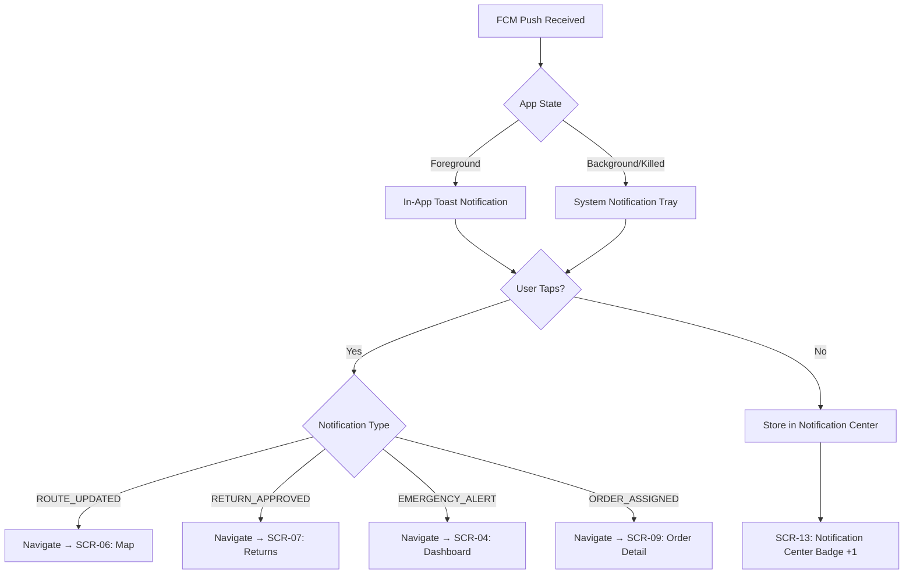

# SCREEN FLOW DOCUMENT
## GharTak — Driver Delivery Mobile Application
### Fresh Box Subscription Delivery Platform

---

**Document Version:** 1.0.0  
**Last Updated:** 2026-06-18  
**Status:** Approved for Development  
**Classification:** Internal — Product Design  
**Prepared By:** Senior Product Team  

---

## Table of Contents
1. [Application Screen Inventory](#1-application-screen-inventory)
2. [Authentication Flow](#2-authentication-flow)
3. [Main App Tab Flow](#3-main-app-tab-flow)
4. [Delivery Confirmation Flow](#4-delivery-confirmation-flow)
5. [Return Request Flow](#5-return-request-flow)
6. [Route Navigation Flow](#6-route-navigation-flow)
7. [Notification Interaction Flow](#7-notification-interaction-flow)
8. [Error & Edge Case Flows](#8-error--edge-case-flows)

---

## 1. Application Screen Inventory

| Screen ID | Screen Name | Route Path | Module |
|-----------|-------------|------------|--------|
| SCR-01 | Splash / Boot Screen | `/` | System |
| SCR-02 | Mobile Number Login | `/(auth)/login` | Auth |
| SCR-03 | OTP Verification | `/(auth)/otp` | Auth |
| SCR-04 | Driver Dashboard | `/(tabs)/` | Dashboard |
| SCR-05 | Delivery List | `/(tabs)/deliveries` | Deliveries |
| SCR-06 | Route Map | `/(tabs)/map` | Routes |
| SCR-07 | Returns List | `/(tabs)/returns` | Returns |
| SCR-08 | Driver Profile | `/(tabs)/profile` | Profile |
| SCR-09 | Order Detail | `/order/[id]` | Deliveries |
| SCR-10 | Delivery Confirm Modal | (Sheet over SCR-09) | Deliveries |
| SCR-11 | Photo Capture Screen | (Camera overlay) | Deliveries |
| SCR-12 | Return Form Modal | (Sheet over SCR-09) | Returns |
| SCR-13 | Notification Center | `/notifications` | Notifications |
| SCR-14 | Security Violation Screen | (Fullscreen overlay) | Security |
| SCR-15 | Offline Banner Component | (Persistent component) | Sync |

---

## 2. Authentication Flow



### 2.1 Screen: SCR-02 — Login Screen
- **Components**: `AppLogo`, `PhoneInput` (flag + number), `RequestOtpButton`
- **Validation**: 10-digit mobile only, formatted as `+91XXXXXXXXXX`
- **States**: Idle → Loading → Error → OTP Sent

### 2.2 Screen: SCR-03 — OTP Verification
- **Components**: `OtpInput` (6 individual cells), `ResendButton` (with 30s cooldown timer), `CountdownTimer`
- **Auto-submit**: triggers `POST /auth/login/verify` when all 6 digits are filled
- **Error States**: Wrong OTP → shake animation + error text | Expired → Resend prompt

---

## 3. Main App Tab Flow



### 3.1 Screen: SCR-04 — Driver Dashboard

**Layout Sections:**
```
┌─────────────────────────────────────┐
│  Good Morning, Rajan! 🌅            │
│  Today: Wednesday, 18 June 2026      │
├──────────┬──────────┬───────────────┤
│ PENDING  │COMPLETED │  RETURNED     │
│   18     │    4     │     1         │
├──────────┴──────────┴───────────────┤
│  📍 Route: Sector 62, Noida          │
│  Estimated: 24 stops · 18.5 km      │
│  [▶ Start Route]                    │
├─────────────────────────────────────┤
│  TODAY'S EARNINGS                   │
│  ₹420 projected · ₹120 confirmed    │
├─────────────────────────────────────┤
│  QUICK ACTIONS                      │
│  [📞 Call Support] [🗺️ Open Map]   │
└─────────────────────────────────────┘
```

### 3.2 Screen: SCR-05 — Delivery List

**Features:**
- Filter tabs: `All | Pending | Completed | Returned`
- Search bar: by customer name or address
- Sort: by route sequence / distance
- Each `DeliveryCard` shows: Customer name, address snippet, product count, status badge

### 3.3 Screen: SCR-06 — Route Map

**Map Layers:**
- Base: OpenStreetMap tiles via `react-native-maps`
- Driver marker: pulsing blue dot (live position)
- Pending delivery markers: orange pins
- Completed markers: green checkmark pins
- Selected order: info card sliding up from bottom

---

## 4. Delivery Confirmation Flow



### 4.1 Screen: SCR-09 — Order Detail

**Sections:**
```
┌─────────────────────────────────────┐
│ ← Order #1001         [📞 Call]     │
├─────────────────────────────────────┤
│ CUSTOMER                             │
│  Amit Sharma  |  +91 99998 88877    │
│  Apt 4B, Sky Heights, Sector 62     │
├─────────────────────────────────────┤
│ PRODUCTS                             │
│  🫙  15L Water   ×2                 │
│  🥦  Organic Tomatoes  ×1 kg        │
│  🍇  Black Grapes  ×500g            │
├─────────────────────────────────────┤
│ DELIVERY NOTES                       │
│  "Leave near shoe rack"              │
├─────────────────────────────────────┤
│ LOCATION                             │
│  [Map Preview]  →  28.6289, 77.3653 │
│  [Navigate] [View on Maps]           │
├─────────────────────────────────────┤
│ [   ✅  DELIVER   ] [ ↩️  RETURN ]  │
└─────────────────────────────────────┘
```

---

## 5. Return Request Flow



### 5.1 Return Reason Options
```
○ Customer Not Available
○ Customer Rejected Order
○ Product Damaged During Transit
○ Wrong Address / Unable to Locate
○ Quantity Mismatch
○ Customer Requested Cancellation
○ Other (with free-text field)
```

---

## 6. Route Navigation Flow



---

## 7. Notification Interaction Flow



---

## 8. Error & Edge Case Flows

### 8.1 Security Violation (Root / Mock GPS)
```
Security Violation Detected
    │
    ▼
SCR-14: Fullscreen Security Block Screen
    │
    ├── Log event to local audit queue
    ├── POST /security/violation (background)
    └── Display: "Device integrity compromised.
                  Contact your supervisor."
        [Only option: Close App]
```

### 8.2 Force Logout (Server-Initiated)
```
Any API call returns 403 with { forceLogout: true }
    │
    ▼
Axios Interceptor catches 403
    │
    ▼
performLogout() executed
    │
    ├── Clear Redux state
    ├── Clear MMKV secureStorage
    └── router.replace('/(auth)/login')
        Banner: "Your session was terminated remotely."
```

### 8.3 Offline State Entry
```
NetInfo: isConnected = false
    │
    ▼
Redux: setNetworkStatus(false)
    │
    ├── Show persistent offline banner
    ├── Disable API-dependent actions (showing local data only)
    └── Enable local queue mode (actions queue to MMKV)
```

---

*Document End — SCREEN_FLOW_DOCUMENT.md v1.0.0*  
*© 2026 GharTak Technologies. All rights reserved.*
