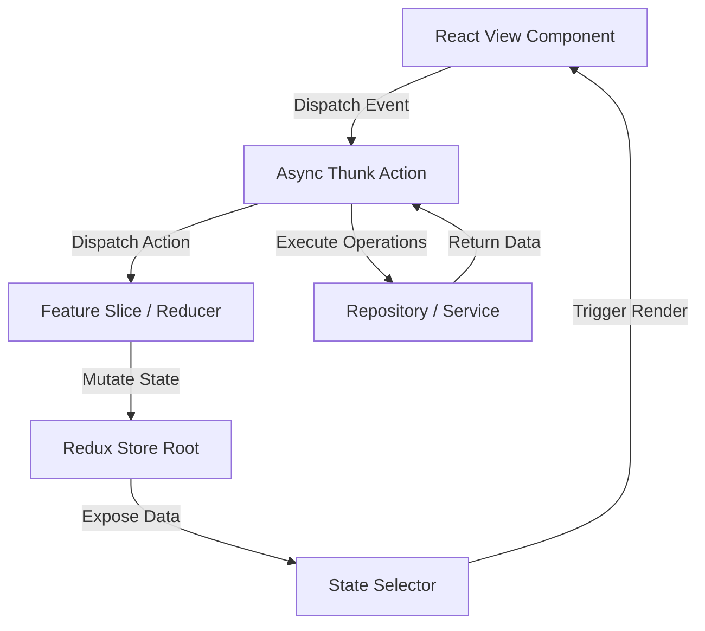

# SOFTWARE ARCHITECTURE DOCUMENT
## GharTak — Driver Delivery Mobile Application
### Fresh Box Subscription Delivery Platform

---

**Document Version:** 1.0.0  
**Last Updated:** 2026-06-18  
**Status:** Approved for Development  
**Classification:** Internal — Engineering  
**Prepared By:** Senior Engineering Team  

---

## Table of Contents
1. [Architectural Style & Design Patterns](#1-architectural-style--design-patterns)
2. [Dependency Rule & Layer Separation](#2-dependency-rule--layer-separation)
3. [Module Directory & Domain Boundaries](#3-module-directory--domain-boundaries)
4. [Component Design System & UI Components](#4-component-design-system--ui-components)
5. [State Management Architecture (Redux Toolkit)](#5-state-management-architecture-redux-toolkit)
6. [Services, Repositories, & Data Access Layer](#6-services-repositories--data-access-layer)
7. [Security Services & Access Control Layer](#7-security-services--access-control-layer)
8. [Offline Synchronization Layer](#8-offline-synchronization-layer)
9. [Audit Logging & Activity Tracking Layer](#9-audit-logging-activity-tracking-layer)
10. [Error Handling & Resiliency Model](#10-error-handling--resiliency-model)

---

## 1. Architectural Style & Design Patterns

The GharTak Driver Delivery App is structured using **Clean Architecture** combined with **Domain-Driven Design (DDD)** concepts and a **Feature-Based Modular Structure**. This ensures loose coupling, testability, and scalability to support thousands of active drivers.

### 1.1 Core Architectural Principles
- **Separation of Concerns (SoC)**: Business rule execution is completely isolated from framework boundaries, presentation logic, and storage mechanisms.
- **SOLID Principles**:
  - *Single Responsibility*: Every class, hook, or service has one purpose.
  - *Open/Closed*: Adding new delivery categories (e.g., subscription vs on-demand) does not require changing core navigation or sync systems.
  - *Liskov Substitution*: Repository interfaces allow swapping storage backends (e.g., migrating MMKV to SQLite) without modifying business rules.
  - *Interface Segregation*: Clients depend only on specific, targeted services (e.g., `LocationService` is isolated from `CameraService`).
  - *Dependency Inversion*: High-level modules (e.g., route validation) depend on abstractions (repository interfaces), not concrete implementations (Axios API calls).

---

## 2. Dependency Rule & Layer Separation

Dependency flow points strictly **inward**. Outer layers can reference inner layers, but inner layers must remain completely unaware of outer layers.

```
       +---------------------------------------------+
       | Data/Infrastructure Layer (Outer)           |
       | - AxiosClient, MMKVStorage, LocationManager |
       +---------------------------------------------+
                              |
                              v
       +---------------------------------------------+
       | Domain Layer (Core)                         |
       | - Entities, Repository Interfaces, Logics   |
       +---------------------------------------------+
                              ^
                              |
       +---------------------------------------------+
       | Presentation Layer (Outer)                  |
       | - Screens, Components, Custom Hooks         |
       +---------------------------------------------+
```

### 2.1 The Domain Layer (Core)
- **Entities**: Plain objects containing state and validation policies (e.g., `Order`, `Route`, `Driver`).
- **Interfaces**: Contracts defining data interactions (e.g., `IOrderRepository`, `IAuthenticationService`).
- Contains no references to Redux, Axios, MMKV, or Expo Router.

### 2.2 The Presentation Layer
- React components and custom hooks (`useLocation`, `useDeliverySync`).
- Selectors and actions interfacing with the Redux State Store.
- Handles rendering, navigation, and user input validation (via React Hook Form).

### 2.3 The Data / Infrastructure Layer
- Concrete implementations of repository interfaces (e.g., `OrderRepository`).
- API communication via Axios instances.
- Low-level hardware drivers (Expo Camera, Expo Location, Expo Notifications).
- Directly interacts with local storage databases (MMKV).

---

## 3. Module Directory & Domain Boundaries

The application is structured into domain-specific modules, breaking away from standard type-based categorization. This groups relevant code (components, hooks, services, state) inside unified feature folders.

```
/features
  /auth
    - components/ (LoginScreen, OtpForm)
    - services/ (AuthService)
    - state/ (authSlice)
  /routes
    - components/ (RouteMap, RouteList)
    - hooks/ (useRouteNavigator)
    - services/ (RouteService)
    - state/ (routeSlice)
  /deliveries
    - components/ (DeliveryCard, PodCapture)
    - hooks/ (useGeofence)
    - repositories/ (DeliveryRepository)
    - state/ (deliverySlice)
  /returns
    - components/ (ReturnForm, ReturnReasonSelector)
    - services/ (ReturnService)
  /tracking
    - services/ (AuditLoggerService, GpsTracker)
```

---

## 4. Component Design System & UI Components

The user interface uses **React Native Paper** (Material Design) with a custom design system configured through CSS variables and native style tokens.

### 4.1 UI Design Guidelines
- **High-contrast interface**: Ensures readability for drivers operating in bright sunlight.
- **Large touch targets**: Interactive buttons have a minimum dimension of `48dp x 48dp`.
- **Component Reusability**: Common components (e.g., `LoadingState`, `ErrorBox`, `AppButton`, `PhotoCaptureModal`) are extracted to `/components/common/` to enforce visual consistency across all feature modules.

---

## 5. State Management Architecture (Redux Toolkit)

Redux Toolkit manages synchronous global application state, while offline databases cache persistence transactions.



### 5.1 Redux Slice Configuration
- `auth`: Stores identity tokens, active driver profile, and device binding tokens.
- `routes`: Manages route assignments, sequence metadata, active stop indices, and route summaries.
- `deliveries`: Controls execution states, selected delivery status, and verification checks.
- `sync`: Monitors transaction queues, connectivity state, and execution flags.
- `notifications`: Stores historical notifications and unread badges.

---

## 6. Services, Repositories, & Data Access Layer

This layer implements the **Repository Pattern** to abstract away database and API interactions.

### 6.1 Repository Pattern Implementation Detail
The presentation layer communicates only with Repository instances using predefined contracts:

```javascript
// Example Contract: IOrderRepository
export class IOrderRepository {
  async getAssignedOrdersForDay(driverId, date) { throw new Error('Not Implemented'); }
  async completeOrderDelivery(orderId, proofData) { throw new Error('Not Implemented'); }
  async registerOrderReturn(orderId, returnData) { throw new Error('Not Implemented'); }
}
```

```javascript
// Concrete Implementation: OrderRepository
export class OrderRepository extends IOrderRepository {
  constructor(apiClient, localStore) {
    super();
    this.apiClient = apiClient;
    this.localStore = localStore;
  }

  async getAssignedOrdersForDay(driverId, date) {
    try {
      const orders = await this.apiClient.get(`/api/v1/routes/${driverId}?date=${date}`);
      await this.localStore.set(`orders_${date}`, orders);
      return orders;
    } catch (error) {
      // Offline fallback
      const cached = await this.localStore.get(`orders_${date}`);
      if (cached) return cached;
      throw error;
    }
  }
  
  // Implementation details...
}
```

---

## 7. Security Services & Access Control Layer

The security layer intercepts operations to ensure system integrity and prevent delivery fraud.

### 7.1 Security Services
- `DeviceValidationService`: Runs on app start. It checks system signatures, emulator indicators (e.g., QEMU drivers, Genymotion properties), and root filesystems.
- `LocationVerificationService`: Intercepts delivery completions. It verifies the driver's GPS coordinates against the order destination and validates that mock location configurations are disabled in the OS developer options.
- `SessionGuard`: A React Native hook/router guard that blocks access to dashboards or routes if active tokens are expired or invalid.

---

## 8. Offline Synchronization Layer

The offline sync layer runs in the background to manage connection transitions and queue processing.

```
                     +----------------------------------------+
                     |        Offline Sync Orchestrator       |
                     +----------------------------------------+
                                  |
            +---------------------+---------------------+
            |                                           |
            v                                           v
+-----------------------+                   +-----------------------+
|  Connectivity Monitor |                   |     Queue Processor   |
| (React Native NetInfo) |                   | (Executes FIFO items) |
+-----------------------+                   +-----------------------+
            |                                           |
            v                                           v
+-----------------------+                   +-----------------------+
|   State: Online /    |                   | Writes to REST Server |
|        Offline        |                   |   (Axios API client)  |
+-----------------------+                   +-----------------------+
```

### 8.1 Transaction Queue Processor
The application uses a persistent queue. If a worker fails to sync due to network drops, it schedules a retry with exponential backoff (`delay = min(base_delay * 2^retries, max_delay)`). In the event of a validation crash or API payload exception (`400 Bad Request`), the system moves the item to a Dead Letter Queue (DLQ) for operations triage.

---

## 9. Audit Logging & Activity Tracking Layer

To maintain a secure and verifiable audit log:

- **`AuditLoggerService`**: Writes structured audit events directly to local MMKV storage.
- **Log Schema**:
  ```javascript
  {
    "eventId": "uuid-v4-string",
    "timestamp": "ISO-8601-string",
    "eventType": "LOGIN" | "LOGOUT" | "DELIVERY_CONFIRMED" | "ROUTE_DEVIATION",
    "driverId": "driver-id-string",
    "deviceMeta": { "os": "android", "version": "12.0", "hardwareId": "x100" },
    "coordinates": { "latitude": 28.6139, "longitude": 77.2090 }
  }
  ```
- **Transmission Policy**: Logs are batched and uploaded every 5 minutes or when the queue reaches 50 events. This minimizes battery drain and network consumption.

---

## 10. Error Handling & Resiliency Model

The application uses structured exceptions to handle errors and maintain a responsive UI.

### 10.1 Global Resiliency Rules
- **API Failures**: Handled by Axios interceptors. Network timeout exceptions display user-friendly retry banners instead of crashing.
- **Media Failures**: If camera capture fails or storage runs low, the app alerts the user and recommends cleanup steps instead of crashing the UI.
- **Crash Recovery**: A global `ErrorBoundary` wraps the application's root component. If a fatal JS exception occurs, the boundary catches it, writes a crash log to local storage, and prompts the driver to restart the app.

---

*Document End — SOFTWARE_ARCHITECTURE_DOCUMENT.md v1.0.0*  
*© 2026 GharTak Technologies. All rights reserved.*
