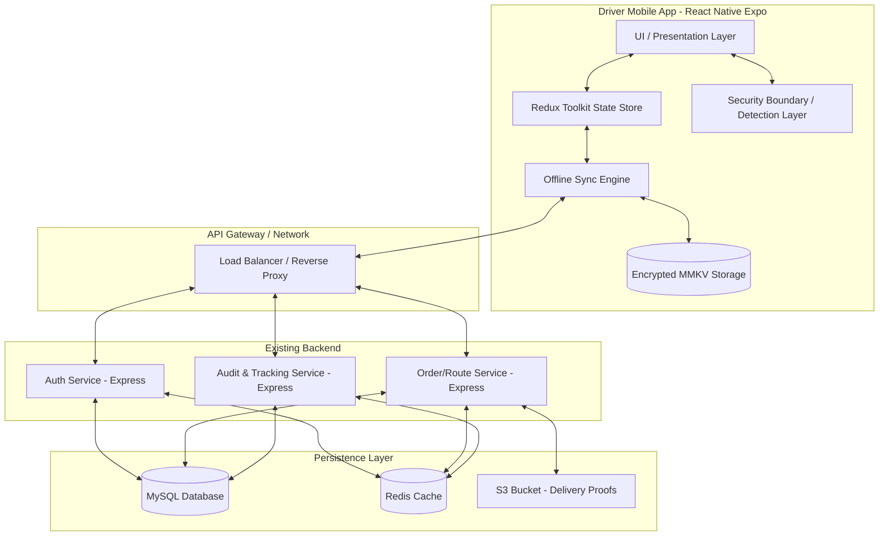
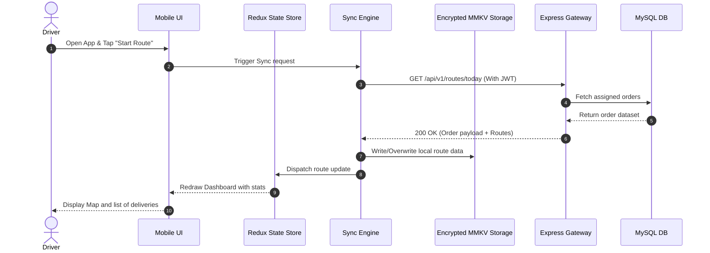
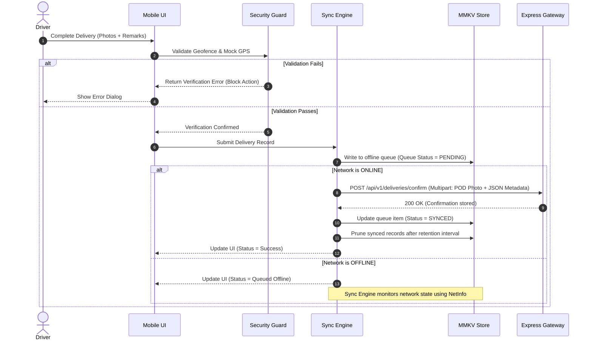

# SYSTEM DESIGN DOCUMENT
## GharTak — Driver Delivery Mobile Application
### Fresh Box Subscription Delivery Platform

---

**Document Version:** 1.0.0  
**Last Updated:** 2026-06-18  
**Status:** Approved for Development  
**Classification:** Internal — Engineering  
**Prepared By:** Senior Engineering Team  

---

## Table of Contents
1. [Introduction & Scope](#1-introduction--scope)
2. [High-Level Architecture](#2-high-level-architecture)
3. [Frontend System Architecture](#3-frontend-system-architecture)
4. [Backend Integration Strategy](#4-backend-integration-strategy)
5. [Data Flow & Module Interaction](#5-data-flow--module-interaction)
6. [API Communication Design](#6-api-communication-design)
7. [Security Boundaries & Topology](#7-security-boundaries--topology)
8. [Offline Synchronization Strategy](#8-offline-synchronization-strategy)
9. [Caching & Local Storage Strategy](#9-caching--local-storage-strategy)
10. [Performance Optimization Techniques](#10-performance-optimization-techniques)
11. [Scalability & Reliability Architecture](#11-scalability--reliability-architecture)

---

## 1. Introduction & Scope

This document details the system design and architecture of the **GharTak Driver Delivery Mobile Application**. The app acts as the execution interface for delivery drivers. It works in conjunction with the existing Node.js, Express.js, and MySQL backend to deliver a highly secure, offline-first, scalable, and performant experience.

The scope of this architecture is to support the operations of up to 50,000 drivers and millions of monthly deliveries. It defines the technical boundaries, protocol standards, synchronizations, security safeguards, and structural components.

---

## 2. High-Level Architecture

The system follows a classic **client-server topology** modified for **offline-first execution**. Below is the structural overview of the entire GharTak ecosystem involving the driver app:



---

## 3. Frontend System Architecture

The React Native application is structured using **Clean Architecture** principles and **Feature-Based Module Division**.

### 3.1 Structural Layering

1. **Presentation Layer**: React Native views, screens, components (React Native Paper), hooks, and forms (React Hook Form).
2. **Domain Layer (Core)**: Entities, business logic, and repository interfaces. This layer is decoupled from specific framework code.
3. **Data Layer**: API clients (Axios), offline-first repository implementations, MMKV database operations, and hardware integrations (Expo Location, Expo Camera).
4. **Cross-Cutting Concerns**: Security validations (root detection, emulator validation, mock GPS guards), analytics, and audit logging.

```
+---------------------------------------------------------+
|                  Presentation Layer                     |
|      Screens (Expo Router) | Components | React Hook Form |
+---------------------------------------------------------+
                            |
                            v
+---------------------------------------------------------+
|                    Domain Layer                         |
|        Entities | Use Cases | Repository Interfaces      |
+---------------------------------------------------------+
                            |
                            v
+---------------------------------------------------------+
|                      Data Layer                         |
|     Repositories | Axios API Client | MMKV Local DB    |
+---------------------------------------------------------+
```

---

## 4. Backend Integration Strategy

The driver app communicates with the pre-existing **Node.js/Express.js REST APIs** backed by **MySQL**. 

### 4.1 Integration Protocol Rules
- **RESTful Endpoints**: All resources are modified or retrieved via standard HTTP verbs (GET, POST, PUT, DELETE).
- **Format**: JSON payload for all API responses and requests except for delivery proof uploads, which use `multipart/form-data`.
- **Stateless Sessions**: The backend maintains no session state; verification relies entirely on cryptographically signed JWT access tokens.
- **Idempotency**: All delivery updates, return requests, and sync operations must include an `idempotency_key` (UUID v4) generated by the app. This prevents duplicate actions if the app retries requests due to flaky network connections.

---

## 5. Data Flow & Module Interaction

### 5.1 Route Synchronization and Live Operations Flow
The diagram below details the step-by-step sequence when a driver fetches assigned orders and begins executing them.



### 5.2 Delivery Confirmation Data Flow (Offline vs. Online)
When a delivery is executed:



---

## 6. API Communication Design

All API transactions are routed through an **Axios** client configured with global interceptors.

### 6.1 Authentication Header
Every API request (except login and token refresh) is appended with:
```http
Authorization: Bearer <JWT_ACCESS_TOKEN>
X-Device-Fingerprint: <HASHED_DEVICE_ID>
```

### 6.2 Access Token Expiry and Refresh Token Rotation Flow
1. If an API request returns an HTTP `401 Unauthorized` status (indicating an expired Access Token):
2. The Axios **Response Interceptor** catches the error and blocks outgoing requests in a queue.
3. The interceptor sends a request to `/api/v1/auth/token/refresh` with the encrypted Refresh Token stored in MMKV.
4. The backend verifies the Refresh Token against the rotation list, issues a *new* Access Token, and a *new* Refresh Token.
5. The interceptor updates MMKV with the new tokens and retries the blocked requests in the queue using the new Access Token.
6. If the refresh token is invalid, expired, or has already been used, the interceptor triggers an app-wide logout state (`Force Logout`).

---

## 7. Security Boundaries & Topology

The application establishes a three-tier security model to isolate user data and operational assets.

```
       [ UNTRUSTED ZONE: Operating System ]
       (Mock GPS, Root Access, Emulators, Keyloggers)
                        |
========================|======================== [ SECURITY GATEWAYS ]
                        v
       [ SECURE MOBILE CLIENT ZONE: GharTak App ]
       (MMKV Encrypted Storage, SSL Pinning, App Protections)
                        |
========================|======================== [ NETWORK ENCRYPTION ]
                        v
       [ ENTERPRISE SERVER ZONE: Node.js Backend ]
       (Role Guards, JWT Validation, Audit Engine, SQL Protection)
```

### 7.1 Security Gateway Implementations
- **App Boundary Protection**: Integrated modules inspect boot state for root markers (e.g., Superuser binary existence, busybox presence). If detected, application code halts with a fatal security violation screen.
- **Location Guard**: Geofence checks must match the device's location (retrieved via `Expo Location`) with the target customer coordinates. The maximum acceptable deviation is **100 meters**.
- **Transport Security**: Dynamic SSL Pinning ensures the app communicates only with verified server certificates, neutralizing man-in-the-middle (MITM) proxy tools.

---

## 8. Offline Synchronization Strategy

The application implements an **Offline-First** model. The local storage represents the system's runtime source of truth.

### 8.1 The Offline Sync Protocol
1. **Action Queue**: All mutating operations (confirming deliveries, starting routes, launching return requests) are written as serialized transaction logs in an MMKV store.
2. **Queue Item Entity Structure**:
   ```javascript
   {
     "id": "uuid-v4-string",
     "action": "ORDER_DELIVER" | "ORDER_RETURN" | "ROUTE_START",
     "timestamp": 1729456789012,
     "payload": { ... },
     "filePath": "/local/uri/to/photo.jpg",
     "status": "PENDING" | "SYNCING" | "FAILED",
     "retryCount": 0
   }
   ```
3. **Synchronization Orchestrator**:
   - Monitors network connection transitions using `NetInfo`.
   - When connection goes online, initiates a queue worker.
   - Pushes items sequentially (FIFO order) to ensure data state consistency.
   - For items with binary attachments (delivery photos): first uploads the photo to the temporary media endpoint, obtains the storage link, references it in the JSON payload, and executes the primary mutation request.

### 8.2 Conflict Resolution Policies
If an order is modified both online and offline, conflict resolution applies the following rules:
- **Server Timestamp Authority**: The server resolves operations using absolute timestamps.
- **Idempotency Matching**: If an offline update arrives for an order that the backend has already marked as completed, the backend ignores the duplicate command and returns a `200 OK` response with the existing state.
- **Logical Priority Override**: A delivery confirmation cannot override an order that has been canceled by operations in the main system database. The local queue worker receives a `409 Conflict` status, discards the queued action, updates local state, and alerts the driver.

---

## 9. Caching & Local Storage Strategy

### 9.1 MMKV Configuration
The app uses **MMKV** instead of AsyncStorage due to its memory-mapped file nature, which makes it 10-50x faster.
- **Instance Isolation**: Separate MMKV instances partition public configuration data (app themes, settings) from secure data (user sessions, auth tokens, cached orders).
- **Encryption**: The secure instance is initialized with a 256-bit key stored securely inside the Android KeyStore or iOS Keychain.

### 9.2 Cache Retention and Pruning Policies

| Data Object | Storage Medium | Encryption | Expiration Policy |
|-------------|----------------|------------|-------------------|
| JWT Tokens | Secure MMKV | AES-256 | Retained until explicit logout or revocation |
| Active Routes | Secure MMKV | AES-256 | Pruned daily during route initialization |
| Offline Queues | Secure MMKV | AES-256 | Maintained until sync confirmation, then marked for deletion |
| Captured Photos | Temporary Cache Dir | No | Deleted automatically after successful sync confirmation |
| Analytics Logs | Standard MMKV | No | Uploaded in batches, cleared weekly |

---

## 10. Performance Optimization Techniques

### 10.1 UI Thread Optimizations
- **Virtualization**: All delivery lists render via `FlashList` (by Shopify) or heavily optimized `FlatList` elements to ensure constant 60 FPS scrolling over thousands of list elements.
- **Render Caching**: Component render trees use `React.memo` to skip re-evaluation unless target properties undergo physical mutations.
- **Image Minimization**: Delivery proof images captured by `Expo Camera` are compressed using `Expo ImageManipulator` to a maximum resolution of 1080p at 75% JPEG quality before queuing for uploads.

### 10.2 Network Optimization
- **Payload Compression**: gzip compression headers are configured on all outgoing/incoming Express transactions.
- **Batching**: Tracking events and audit logs are queued and uploaded in unified batch requests (max 50 events per batch) instead of single requests.

---

## 11. Scalability & Reliability Architecture

To scale from 10 drivers to 50,000 drivers and handle millions of orders:

```
                  [ 50,000 Concurrent Drivers ]
                                |
                                v
               [ Reverse Proxy & API Gateway ]
               (Rate Limiting & IP Verification)
                                |
                                v
        [ Stateless Application Servers (Node.js/Express) ]
        (Auto-scaled horizontally based on CPU/Memory load)
                                |
             +------------------+------------------+
             |                                     |
             v                                     v
     [ Redis Cache Store ]                 [ MySQL Database ]
 (Routes & Token Validation)          (Primary Storage, Master-Slave)
```

### 11.1 Key Scalability Controls
- **Stateless Application Servers**: Allows the backend to scale horizontally with load.
- **Database Index Optimization**: MySQL queries filter on indexed keys (`driver_id`, `route_date`, `status`).
- **Read-Write Separation**: The backend routes reporting and historical queries to read replicas, preserving the primary master DB for active route updates.
- **Rate Limiting**: Express.js uses Redis-backed rate limiters configured to prevent clients from overwhelming the system during bulk synchronization phases.

---

*Document End — SYSTEM_DESIGN_DOCUMENT.md v1.0.0*  
*© 2026 GharTak Technologies. All rights reserved.*
